# Linux Apps Manager

Linux Apps Manager is a shell script program that allows you to easily manage your Linux apps using different app managers such as APT, Pacman, DNF, DEB, RPM, Snap and Flatpak. It also has functionality to manage NVIDIA Drivers.

## Features

- List all installed apps including runtimes
- List user installed apps
- Install flatpak & snap in one click
- Update all apps
- Downgrade apps
- Search and install apps
- Uninstall apps
- Delete unnecessary data & cache
- Manage permissions for snap & flatpak apps
- Manage NVIDIA drivers
- Switch between different app managers

## Screenshots
<div align="center">
    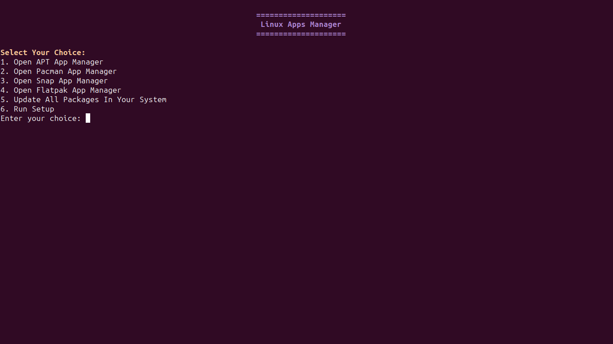
</div>
<div align="center">
    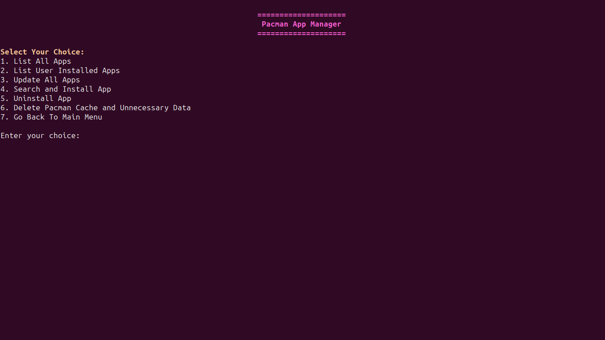
</div>
<div align="center">
    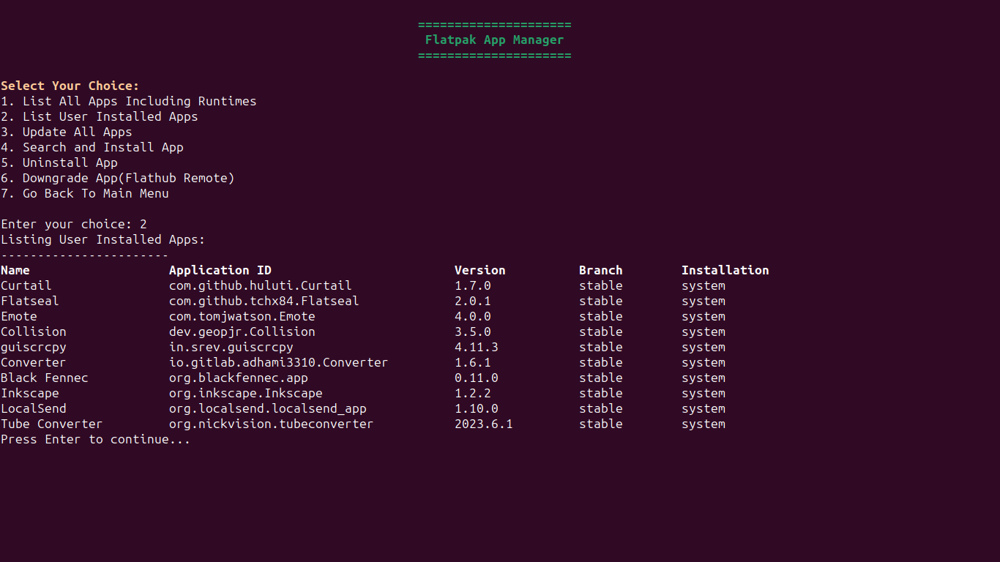
</div>
<div align="center">
    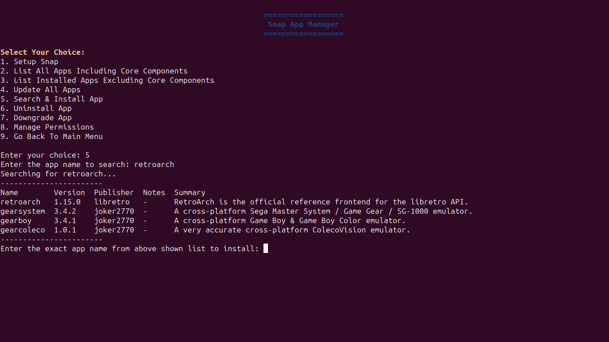
</div>
<div align="center">
    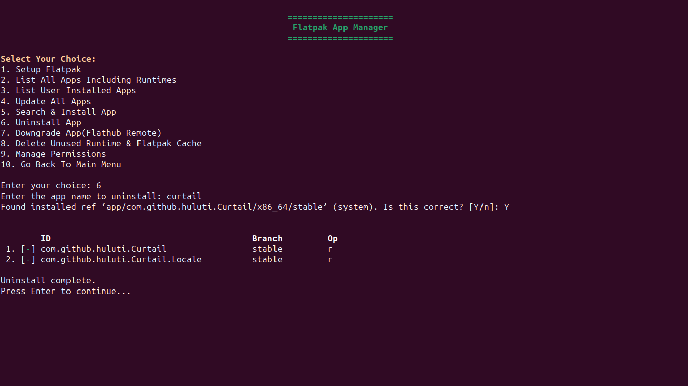
</div>
<div align="center">
    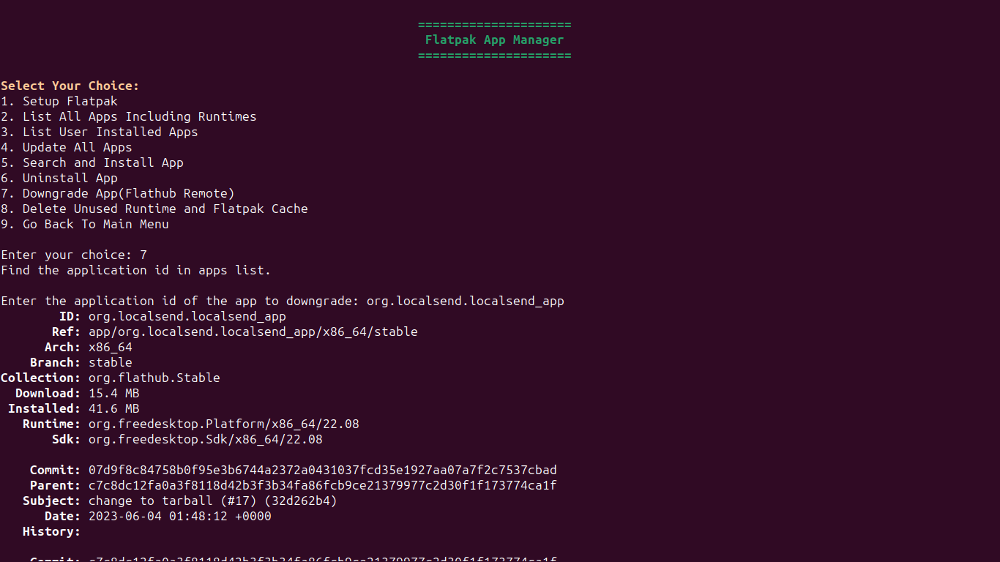
</div>
<div align="center">
    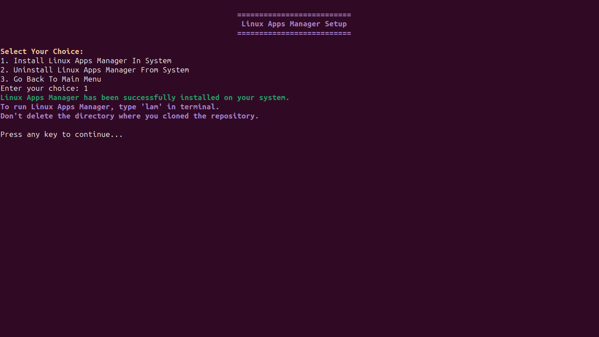
</div>
<div align="center">
    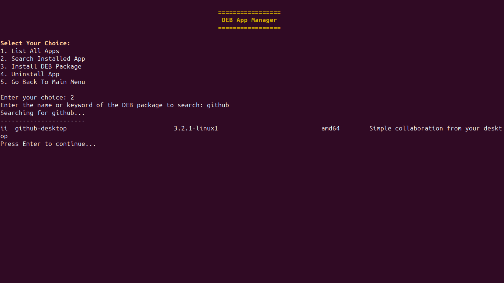
</div>
<div align="center">
    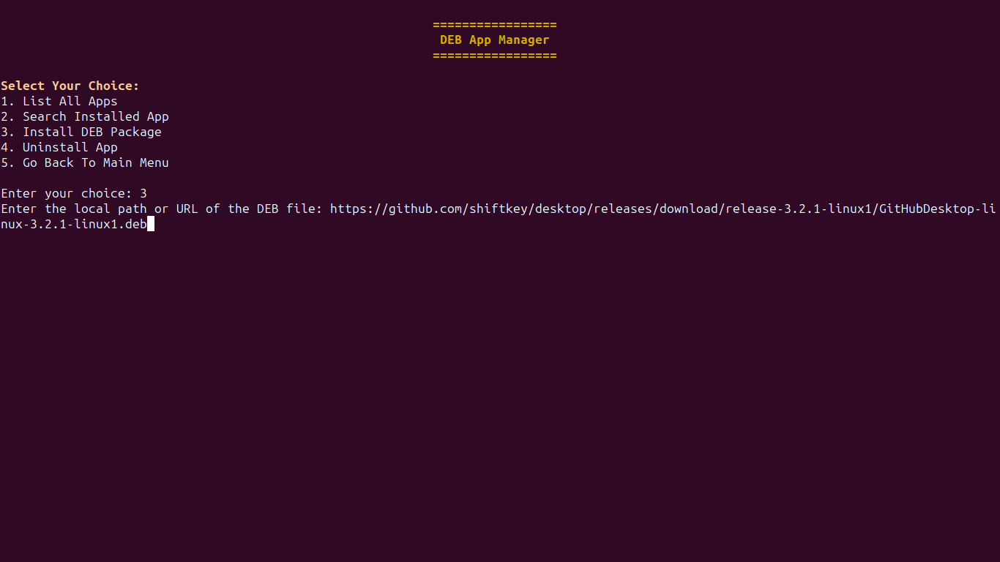
</div>
<div align="center">
    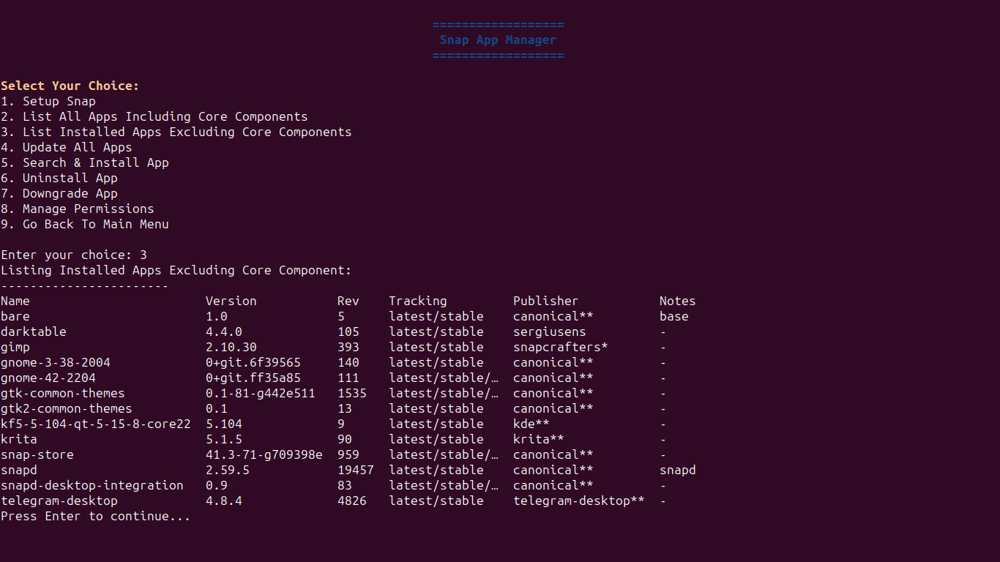
</div>
<div align="center">
    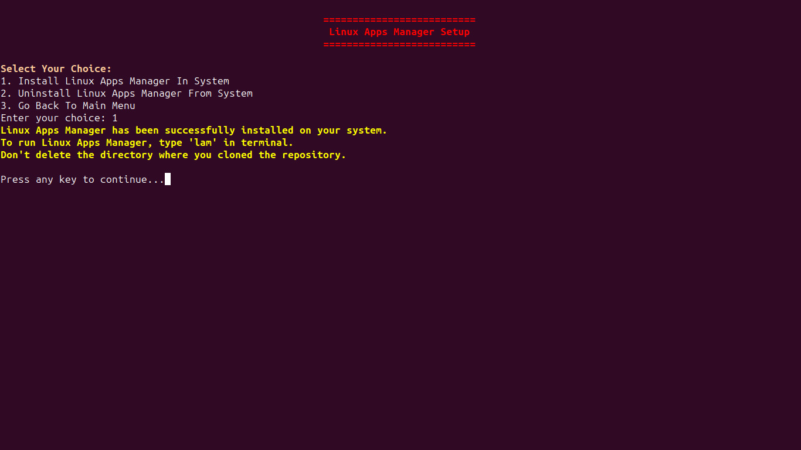
</div>

## Usage

To use Linux Apps Manager, you have two options:

### Option 1: Run it manually

1. Clone this repository to your desired location.
2. Run the manager script with the following command:

```sh
chmod +x manager && ./manager
```

3. Choose the app manager you want to use from the main menu.
4. Choose the option you want to perform from the sub-menu.
5. Follow the instructions on the screen.

### Option 2: Install it permanently

1. Clone this repository to your desired location.
2. Run the manager script with the following command:

```sh
chmod +x manager && ./manager
```

3. Choose the option 11 to run setup.
4. Choose the option 1 to install Linux Apps Manager in your system.
5. To run Linux Apps Manager, type `lam` in your terminal.
6. Choose the app manager you want to use from the main menu.
7. Choose the option you want to perform from the sub-menu.
8. Follow the instructions on the screen.

**Note:** This option requires a shell that has a .rc file such as bash, zsh, csh, ksh or tcsh. If your shell does not have a .rc file, you can use option 1 instead.

#### Uninstallation

To uninstall Linux Apps Manager from your system, follow these steps:

1. Run `lam` in your terminal.
2. Choose the option 11 to run setup.
3. Choose the option 2 to uninstall Linux Apps Manager from your system.

## License

This project is licensed under the GPL v3 License - see the [LICENSE](https://github.com/saitamasahil/LinuxAppsManager/blob/main/LICENSE) file for details. This means you can use, modify and distribute this software as long as you respect the freedom of others. If you don’t, we will send a horde of angry penguins to your doorstep. 🐧
